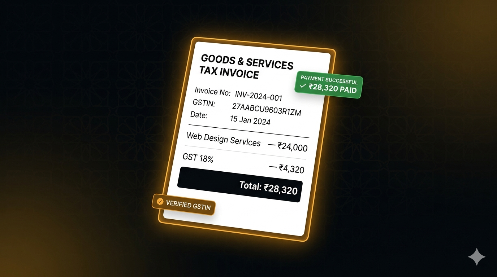

<div align="center">
  
</div>

<br />

<div align="center">

# InvoiceKit Pro

### Privacy-first GST invoice generator for Indian freelancers and small businesses.

*CGST, SGST, IGST auto-calculated. Your data never leaves your device.*

<br />

[](#license)
[](https://invoicekit.harmnix.com)
[](https://react.dev/)
[](https://tailwindcss.com/)
[](https://vitejs.dev/)
[](https://developer.mozilla.org/en-US/docs/Web/Progressive_web_apps)

<br />

**[🔗 invoicekit.harmnix.com](https://invoicekit.harmnix.com)**

</div>

---

## Contents

- [Overview](#overview)
- [Features](#features)
- [Tech Stack](#tech-stack)
- [How It Works](#how-it-works)
- [Getting Started](#getting-started)
- [Usage](#usage)
- [Pricing](#pricing)
- [Roadmap](#roadmap)
- [Privacy & Data](#privacy--data)
- [Publishing to a Public Repo](#publishing-to-a-public-repo)
- [License](#license)

---

## Overview

InvoiceKit Pro is a **privacy-first invoicing application** designed specifically for the Indian tax landscape. Unlike cloud accounting tools that store your financial data on remote servers, InvoiceKit keeps everything in your browser's IndexedDB — you're the only one who ever sees your invoices, clients, and financial reports.

The app automatically determines whether to apply **CGST+SGST** (intra-state) or **IGST** (inter-state) based on your business state code and your client's state code. All standard Indian GST rates (0%, 5%, 12%, 18%, 28%) are supported.

---

## Features

### Core Invoicing

- **GST-Compliant Invoices** — Professional PDF invoices with all mandatory GST fields (GSTIN, HSN/SAC codes, state codes, tax breakdown)
- **Auto GST Calculation** — Automatically calculates CGST, SGST, or IGST based on supplier and recipient state codes
- **Invoice Management** — Create, edit, delete, filter, and search invoices by status, financial year, or client
- **Invoice Numbering** — Auto-incrementing invoice numbers with customizable prefix
- **Proforma & Credit Notes** — Support for proforma invoices and credit notes with watermark

### Client & Expense Management

- **Client Database** — Store client names, GSTINs, addresses, and state codes for one-click reuse
- **GSTIN Validation** — Built-in GSTIN format validation
- **Expense Tracking** — Categorize and track business expenses alongside invoices
- **Financial Years** — All data organized by Indian financial year (e.g., 2024-25)

### Reports & Export

- **GSTR-1 Summary** *(Pro)* — Generate GSTR-1 preparation reports grouped by GST rate
- **P&L Statements** *(Pro)* — Automatic profit and loss statements for your CA
- **PDF Export** — Professional, GST-compliant PDF invoices with QR codes
- **WhatsApp Share** — Share invoices directly via WhatsApp
- **Data Backup & Restore** *(Pro)* — Export/import all data as JSON

### Privacy & Local-First

- **100% Offline** — Works without internet after initial load
- **IndexedDB Storage** — All data stored locally via Dexie.js
- **No Cloud Sync** — Your financial records never touch a server
- **PWA Installable** — Install as a native app on mobile and desktop

### Pro Features

- Unlimited invoices (free tier: 10 invoices)
- GSTR-1 summary reports
- Profit & Loss statements
- Data backup & restore
- Expense CSV export
- Priority support

---

## Tech Stack

| Layer | Technology | Purpose |
| :--- | :--- | :--- |
| Frontend | React 19 + JSX | Component-based UI |
| Routing | React Router 6 | SPA routing |
| Styling | Tailwind CSS 3 | Utility-first responsive design |
| State | React hooks + context | Reactive UI state |
| Storage | Dexie.js (IndexedDB) | Local-first data persistence |
| PDF Generation | jsPDF + jspdf-autotable | GST-compliant invoice PDFs |
| QR Codes | qrcode.js | Invoice and UPI payment QR codes |
| Payments | Razorpay | Secure payment processing |
| Meta | react-helmet-async | Dynamic SEO meta tags |
| Error Tracking | Sentry | Error monitoring (opt-in via env) |
| Backend | Cloudflare Workers | License verification + payment API |
| Data Store | Cloudflare KV | License keys storage |
| Hosting | Cloudflare Pages | Global edge deployment |

---

## How It Works

The app runs entirely in the browser. Data flow is simple and privacy-preserving:

### Data Flow

1. **User creates an invoice** → browser saves data to IndexedDB
2. **User selects states** → app calculates CGST/SGST/IGST automatically
3. **User exports PDF** → browser generates document locally — no server needed
4. **Pro user pays** → browser sends payment request to Cloudflare Worker
5. **Worker verifies payment** → stores license key in Cloudflare KV
6. **License check** → browser verifies pro status with worker (30-day cache)

### Where Data Lives

| Data Type | Stored In | Persists? | Encrypted? |
| :--- | :--- | :--- | :--- |
| Invoices | IndexedDB | Yes | No |
| Clients | IndexedDB | Yes | No |
| Expenses | IndexedDB | Yes | No |
| Settings | IndexedDB | Yes | No |
| License Keys | Cloudflare KV | Yes | No |
| Payment Orders | Razorpay | Yes | Yes (TLS) |

---

## Getting Started

### Quick Start (User)

No installation required — visit [invoicekit.harmnix.com](https://invoicekit.harmnix.com) and start creating invoices immediately.

### Local Development

```bash
# Clone the repository
git clone <your-repo-url>
cd invoicekit

# Install dependencies
npm install

# Start the dev server
npm run dev

# Build for production
npm run build
```

### Worker Setup (for Pro features)

```bash
cd worker

# Install Wrangler
npm install -g wrangler

# Login to Cloudflare
wrangler login

# Create KV namespace
wrangler kv:namespace create "LICENSES"

# Set secrets
wrangler secret put RAZORPAY_KEY_ID
wrangler secret put RAZORPAY_KEY_SECRET
wrangler secret put RAZORPAY_WEBHOOK_SECRET
wrangler secret put LICENSE_SECRET

# Deploy
wrangler deploy
```

### Environment Variables

Create a `.env` file in the root directory:

```env
# Required for payment processing
VITE_RAZORPAY_KEY_ID=rzp_live_YOUR_KEY_ID

# Optional: override API URL (defaults to the worker URL)
VITE_API_URL=https://api.YOUR_DOMAIN.com

# Optional: Sentry error tracking
VITE_SENTRY_DSN=https://your-dsn@o000000.ingest.us.sentry.io/000000
```

---

## Usage

### 1. Set Up Your Business Profile
1. Open the app and navigate to **Settings**
2. Enter your business name, GSTIN, address, and state
3. Add bank details (name, account number, IFSC) for invoice display
4. Configure invoice prefix (e.g., `INV-`) and starting number
5. *(Optional)* Add UPI ID for payment QR codes

### 2. Create Your First Invoice
1. Go to **Invoices** and click **New Invoice**
2. Select or create a client (name, GSTIN, address, state)
3. Add line items with descriptions, HSN/SAC codes, quantities, rates, and GST rates
4. The tax breakdown (CGST + SGST or IGST) is calculated automatically
5. Preview the invoice and download as PDF or share via WhatsApp

### 3. Track Expenses
1. Go to **Expenses** and click **Add Expense**
2. Enter amount, date, category, description, and financial year
3. View expense summaries on the dashboard

### 4. Generate Reports *(Pro)*
1. Go to **Reports** to view GSTR-1 summaries and P&L statements
2. Filter by financial year
3. Export reports for your CA

### 5. Upgrade to Pro
1. Click **Upgrade to Pro** from the sidebar or pricing section
2. Choose Monthly (₹149) or Annual (₹999 — save 44%)
3. Complete payment via Razorpay (UPI, card, net banking, wallet)
4. Pro features unlock immediately

---

## Pricing

| Plan | Price | Invoices | Features |
| :--- | :--- | :--- | :--- |
| **Free** | ₹0 | Up to 10 | GST calculation, PDF export, client management, expenses |
| **Pro** | ₹999/yr (₹149/mo) | Unlimited | GSTR-1 reports, P&L statements, backup/restore, CSV export |

---

## Roadmap

### Completed
- [x] GST-compliant invoice generation with auto CGST/SGST/IGST
- [x] Client management with GSTIN validation
- [x] Expense tracking with categories
- [x] Professional PDF export with QR codes
- [x] WhatsApp invoice sharing
- [x] GSTR-1 summary reports *(Pro)*
- [x] P&L statements *(Pro)*
- [x] Data backup & restore *(Pro)*
- [x] Razorpay payment integration
- [x] PWA offline support
- [x] Proforma invoices and credit notes
- [x] E-Invoice IRN support

### Planned
- [ ] Multi-currency support
- [ ] Email invoice delivery
- [ ] Recurring invoice templates
- [ ] Bulk invoice operations
- [ ] Mobile-optimized camera GSTIN scanner
- [ ] Dark mode

---

## Privacy & Data

Your financial data never leaves your device unless you explicitly choose to export it.

### Local Storage (IndexedDB)

All invoices, clients, expenses, and settings are stored in your browser's IndexedDB database. No server or third party receives this data.

### Network Activity

| Action | Data Sent | Destination | Trigger |
| :--- | :--- | :--- | :--- |
| License Verification | License key | Cloudflare Worker | App load |
| Order Creation | Plan type, amount | Cloudflare Worker | Clicking Pay |
| Payment Confirmation | Payment ID, Order ID | Cloudflare Worker | After payment |
| Analytics Event | Event name | Cloudflare Worker | User actions |

### Backend Storage

The Cloudflare Worker stores only license keys and anonymous analytics events. The backend has **zero access** to your invoices, clients, or financial data.

---

## Publishing to a Public Repo

This repository is sanitized for public publishing. Here's what was done:

### Sanitized Files

| File | What Was Changed |
| :--- | :--- |
| `worker/wrangler.toml` | KV namespace ID → `YOUR_KV_NAMESPACE_ID`, route → `api.YOUR_DOMAIN.com` |
| `src/lib/license.js` | Hardcoded worker URL → configurable via `window.__INVOICEKIT_API_URL` or `VITE_API_URL` env var |
| `src/components/PaymentButton.jsx` | Hardcoded `API_BASE_URL` → configurable runtime override |
| `src/lib/sentry.js` | Real Sentry DSN → `import.meta.env.VITE_SENTRY_DSN` env var |

### Files Created

| File | Purpose |
| :--- | :--- |
| `LICENSE` | Proprietary "All rights reserved" |
| `worker/.env.example` | Template for worker environment variables |
| `assets/InvoiceKit.png` | README hero banner |

### Security Model (safe to publish because)

- All secrets (Razorpay keys, webhook secrets, license secret) are set via `wrangler secret put` — never in code
- The Worker source reads secrets from `env.*` bindings only
- Payment processing is server-side validated — someone can't use your keys without proper integration
- License verification uses HMAC-SHA256 signing — keys can't be forged
- Rate limiting protects API endpoints from abuse

### Before You Deploy

Replace the following placeholders:

1. In `worker/wrangler.toml`: `YOUR_KV_NAMESPACE_ID`, `YOUR_DOMAIN`
2. Set Worker secrets: `RAZORPAY_KEY_ID`, `RAZORPAY_KEY_SECRET`, `RAZORPAY_WEBHOOK_SECRET`, `LICENSE_SECRET`
3. Configure `VITE_RAZORPAY_KEY_ID` in Cloudflare Pages environment variables
4. Update the landing page in `index.html` with your actual domain and Google Analytics ID

---

## Project Structure

```
invoicekit/
├── README.md
├── LICENSE
├── index.html
├── package.json
├── vite.config.js
├── tailwind.config.js
├── postcss.config.js
├── .gitignore
├── worker/
│   ├── wrangler.toml
│   ├── .env.example
│   └── index.js
├── public/
│   ├── _headers / _redirects
│   ├── robots.txt / sitemap.xml
│   ├── manifest.json
│   ├── 404.html
│   ├── favicon.svg / og-image.png
│   └── hsn-codes.json
├── assets/
│   └── InvoiceKit.png
└── src/
    ├── main.jsx
    ├── App.jsx
    ├── index.css
    ├── App.css
    ├── lib/
    │   ├── db.js
    │   ├── license.js
    │   ├── gst.js
    │   ├── constants.js
    │   ├── analytics.js
    │   ├── pdf.js
    │   ├── hsn.js
    │   ├── sentry.js
    │   └── formatters.js
    ├── hooks/
    │   ├── useLicense.js
    │   └── useDb.js
    ├── components/
    │   ├── PaymentButton.jsx
    │   ├── ui/
    │   ├── layout/
    │   ├── invoice/
    │   ├── client/
    │   └── expense/
    ├── pages/
    ├── utils/
    └── assets/
```

---

## License

Copyright (c) 2025 Harmnix. All rights reserved.

This source code is provided for portfolio and reference purposes only. Commercial use, redistribution, or self-hosting is not permitted without prior written permission from the copyright holder.

---

## Author

Built by **[Harmnix](https://harmnix.com)** — a portfolio of developer tools and productivity apps for Indian users.

- Support: [support@invoicekit.harmnix.com](mailto:support@invoicekit.harmnix.com)
- Website: [invoicekit.harmnix.com](https://invoicekit.harmnix.com)
